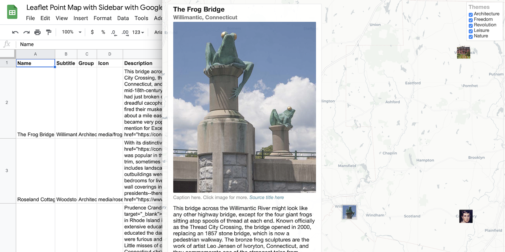
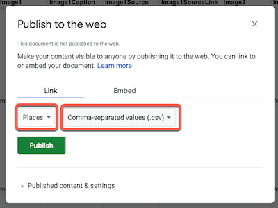

# cth-leaflet-point-map-sidebar
CTH Leaflet Point Map with Sidebar with Google Sheets



Demo: https://jackdougherty.github.io/cth-leaflet-point-map-sidebar

Google Sheet: https://docs.google.com/spreadsheets/d/1h1rJa-fshPbuzaqabQUjIDmuM2O6f5K0KPEvaAQT568/edit#gid=0

Created by Ilya Ilyankou and Jack Dougherty. Learn more and see related Leaflet map templates with Google Sheets in our book, Hands-On Data Visualization: https://handsondataviz.org/leaflet.html

## Edit and store data in Google Sheets or CSV
The map pulls data for each place from a single CSV file that matches our Google Sheets template.
You can store your data remotely (in a published Google Sheet) or locally (as a CSV file in your online GitHub folder).

To store your data remotely in Google Sheets, go to our template to *File > Make a Copy* and store in your Google Drive. Your Google Sheet must be public and published.
Click `Share` button, and change permissions to *Anyone on the internet with this link can view*.
Then go to `File > Publish to the web > Places`,
and choose `Comma-separated values (.csv)` as shown below.



Copy and paste the published URL into the `dataLocation`
variable in the `settings.js` file as shown below. Make sure that the long link ends in: `.../pub?gid=0&single=true&output=csv`

```
// Where to load data from. Choose either a local file, such as `data/places.csv`,
// or a Google Sheets URL (File > Publish to the Web > CSV )
const dataLocation = 'https://docs.google.com/spreadsheets/d/e/2PACX-1vQCz1kNG2vxDke45Q0H8moWaFZZ-dhRSp34EKD_eMVWE-YjJTFDAcxdXydWSJ26JF4Ap4zlaZD1p9oi/pub?gid=0&single=true&output=csv';
```

Or, after you finish creating your map data in Google Sheets, you can *File > Download* as a CSV file and store it locally in your online copy of the GitHub folder, and enter the file pathname (such as `data/places.csv`) into the `dataLocation` variable `settings.js` file above. Storing your data locally with the map code template is a good strategy for long-term preservation, because you no longer depend on a remote link to the Google Sheets platform. Also, you can always re-edit the CSV file as needed on GitHub or with a spreadsheet tool.

Unlike some of our other Leaflet templates with Google Sheets, you do **not** need to create a Google API key for this tool, because it pulls all data from *one* CSV, and your CSV is available to download by anyone with the link.

## About entering text into the template
This sidebar map was designed to display multiple paragraphs of text into the *Description* field for each location. Also, the text must be consistent with HTML coding. This means to use *straight* single-quotes (also known as apostrophes) and double-quotes (`"`), *not* curly quotes that are commonly created by word-processor tools. To create a new paragraph, insert a double line-break (`<br><br>`). To enter links, use HTML tags to open in a new browser tab, such as:

```
.<br><br><a href='https://connecticuthistory.org/bridge-ornaments-help-tell-the-legend-of-the-windham-frog-fight/' target='_blank'>More</a> about Windham's Frog Fight
```

When working with large amounts of *Description* text, you may find it easiest to first use a text editor tool such as [Atom Editor](https://atom.io), create a file named `temporary.html`, set *View > Toggle Soft Wrap*, and prepare all of your *Description* text there before copying and pasting into the Google Sheet. Also, install the [Dumb-Quoter Atom Package](https://atom.io/packages/dumb-quoter) to convert curly-quotes into straight-quotes with CTRL-ALT-' (or CTRL-OPTION-' on Mac).

In Google Sheets, use *Format > Text wrapping > Wrap* to view the entire cell as needed, then go back to *Overflow* when done.  


## Edit map title and default text
Go to `index.html` to edit the map title, introductory text, and footer, which always appears in the sidebar when users click on different places.

Enter map initial center and zoom level in `settings.js`:
```
// Map's initial center, and zoom level
const mapCenter = [41.65, -72.7];
const mapZoom = 9;
```

In the maps legend, the label *Themes* corresponds to *Groups* in the Google Sheet template. To edit this label in the map, go to `script.js` and modify the label "Themes" in this line:

```
L.control.layers({}, groups, {collapsed: false}).addTo(map);
$('.leaflet-control-layers-overlays').prepend('<h3 class="mt0 mb1 f5 black-30">Themes</h3>');
```

## Assign the same place to 2 or more categories
If a place needs to belong to two or more groups (also known as themes or categories),
duplicate its row as many times as needed, and each time modifying its
*Group* column only.

## Add images
Each place can have up to 5 images, which you upload to a subfolder in your GitHub repo and enter the pathname into the Google Sheets template, such as: `media/frog-bridge.jpg`. We recommend that you reduce image sizes to approximately 1200 x 1000 pixels or less to ensure speedy display. Only the 1st of 5 images is shown in the sidebar. To scroll through the gallery, click the 1st image to bring up a full-screen lightbox interface. The lightbox will say how many images there are, and will show
a caption, source, and link (if available) for each image.

## Add custom thumbnail photo icons
Each place can have 1 custom thumbnail photo icon. Make a copy of your main image, then use a photo editor to crop and reduce the size to 64 x 64 pixels square, and upload into your GitHub repo and enter the pathname into the Google Sheets template, such as: `media/frog-bridge-icon.jpg`.

In `settings.js`, you can modify the photo icon size as desired, such as 40 x 40 pixels, to squeeze multiple icons on a crowded map.

```
// Marker icon height and width
const iconHeight = 40;
const iconWidth = 40;
```

#### Geocode your address data with Google Sheets add-on
To make icons appear in locations on your map, you need to geocode your data, which means to find and enter latitude and longitude coordinates for each point. We recommend installing the free [Geocoding by SmartMonkey add-on for Google Sheets](https://gsuite.google.com/marketplace/app/geocoding_by_smartmonkey/1033231575312). Insert your addresses in place of the samples in the Geocoding Details tab, then use Add-Ons > Geocoding > Geocode Details menu. Learn more in *Hands-On Data Visualization* https://handsondataviz.org/geocode.html


## Add Google Maps links for directions
This map will automatically display a box under each place description with a Google Maps link for directions, if you enter the proper Google Maps link into your data. Use [Google Maps](https://www.google.com/maps) to search a place (such as
"Frog Bridge, Connecticut"), then select `Share` button, and copy the *Link to share*, which appears similar to this: `https://goo.gl/maps/gLbedFmJBE31h9t2A`. Paste into the `GoogleMapsLink` column in the data template.

## Share web links with URL hash
When a place icon is clicked, its name is added to the hash part of the URL, and appears in your browser like this:

`https://handsondataviz.github.io/leaflet-point-map-sidebar/#Frog-Bridge`

This feature enables you to share a particular place with others on social media, because when the map is loaded initially,
it activates the place from hash if it exists instead of centering
on default `mapCenter` (as defined in `settings.js`).

## Learn more
See related Leaflet Maps code templates in our book, [Hands-On Data Visualization](https://handsondataviz.org).
